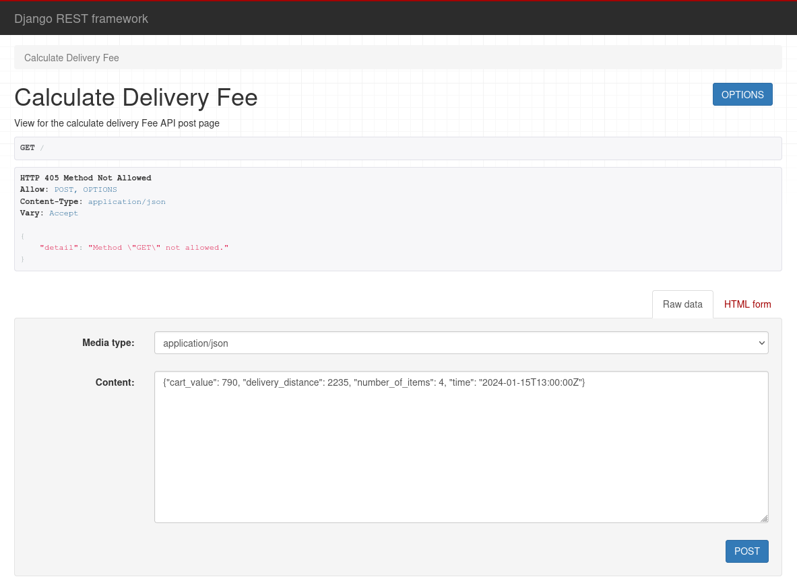
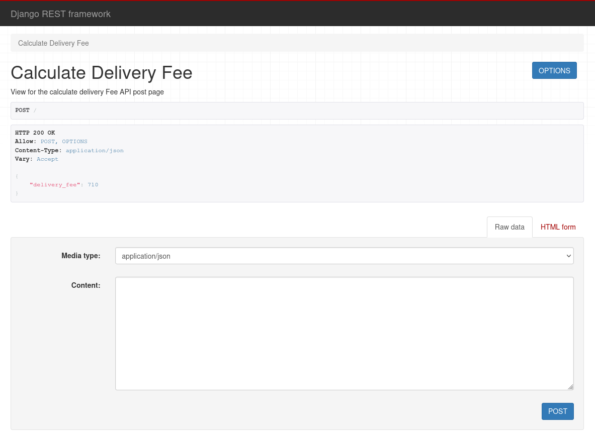
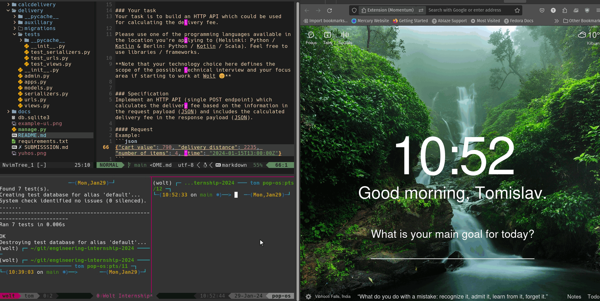
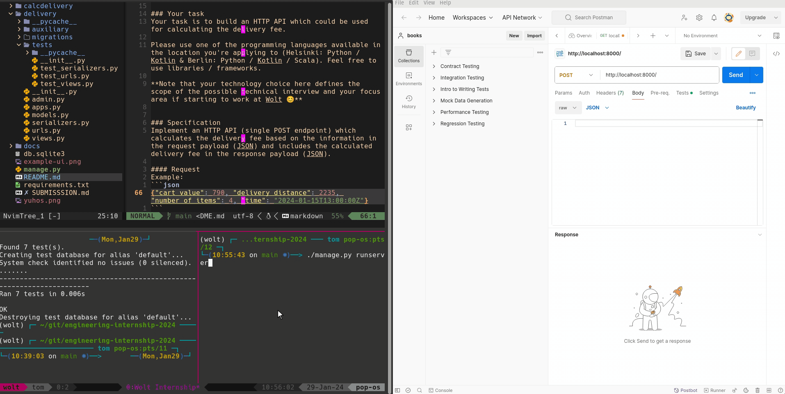

**Wolt Summer 2024 Engineering Internships**


Preliminary Assignment for backend internships.

- Django REST API Solution

[Original GitHub Repo with the Problem Docs](https://github.com/woltapp/engineering-internship-2024/tree/5a3edf8744925e9b20a58a1376ec20e998fad1e2)

[Problem Guide MarkDown](./PROBLEM.md)

# Delivery Fee Calculator

---

# Table of Contents

<!-- vscode-markdown-toc -->

- 1. [The Project Problem Statement](#the-project-problem-statement)
  - 1.1. [Specification](#specification)
- 2. [Backend specifics](#backend-specifics)
  - 2.1. [Your task](#your-task)
  - 2.2. [Specification](#specification-1)
    - 2.2.1. [Request](#request)
    - 2.2.2. [Response](#response)
    - 2.2.3. [Request](#request-1)
    - 2.2.4. [Response](#response-1)
- 3. [Django API Solution](#django-api-solution)
  - 3.1. [Installation](#installation)
  - 3.2. [API functionality](#api-functionality)
  - 3.3. [Technologies Used](#technologies-used)
  - 3.4. [Django App Structure](#django-app-structure)
  - 3.5. [Database Model](#database-model)
  - 3.6. [Django API Features](#django-api-features)
    - 3.6.1. [Calculator Module](#calculator-module)
    - 3.6.2. [Serializer](#serializer)
    - 3.6.3. [View](#view)
- 4. [Testing](#testing)
  - 4.1. [Automated tests](#automated-tests)
  - 4.2. [Manual Testing](#manual-testing)
- 5. [Author](#author)

<!-- vscode-markdown-toc-config
	numbering=true
	autoSave=true
	/vscode-markdown-toc-config -->
<!-- /vscode-markdown-toc -->

---

## 1. <a name='the-project-problem-statement'></a>The Project Problem Statement

The goal of the assignment is to showcase your coding skills and ability to develop features. This is a highly important part of the hiring process so it's crucial to put effort into this without making it too bloated. Reviewers will put weight on three main aspects: code quality, maintainability, and testing. Based on the results of the assignment review, we will make the decision on proceeding to the technical interview.

Your task is to write a delivery fee calculator. This code is needed when a customer is ready with their shopping cart and we’d like to show them how much the delivery will cost. The delivery price depends on the cart value, the number of items in the cart, the time of the order, and the delivery distance.

### 1.1. <a name='specification'></a>Specification

Rules for calculating a delivery fee

- If the cart value is less than 10€, a small order surcharge is added to the delivery price. The surcharge is the difference between the cart value and 10€. For example if the cart value is 8.90€, the surcharge will be 1.10€.
- A delivery fee for the first 1000 meters (=1km) is 2€. If the delivery distance is longer than that, 1€ is added for every additional 500 meters that the courier needs to travel before reaching the destination. Even if the distance would be shorter than 500 meters, the minimum fee is always 1€.
  - Example 1: If the delivery distance is 1499 meters, the delivery fee is: 2€ base fee + 1€ for the additional 500 m => 3€
  - Example 2: If the delivery distance is 1500 meters, the delivery fee is: 2€ base fee + 1€ for the additional 500 m => 3€
  - Example 3: If the delivery distance is 1501 meters, the delivery fee is: 2€ base fee + 1€ for the first 500 m + 1€ for the second 500 m => 4€
- If the number of items is five or more, an additional 50 cent surcharge is added for each item above and including the fifth item. An extra "bulk" fee applies for more than 12 items of 1,20€
  - Example 1: If the number of items is 4, no extra surcharge
  - Example 2: If the number of items is 5, 50 cents surcharge is added
  - Example 3: If the number of items is 10, 3€ surcharge (6 x 50 cents) is added
  - Example 4: If the number of items is 13, 5,70€ surcharge is added ((9 \* 50 cents) + 1,20€)
  - Example 5: If the number of items is 14, 6,20€ surcharge is added ((10 \* 50 cents) + 1,20€)
- The delivery fee can **never** be more than 15€, including possible surcharges.
- The delivery is free (0€) when the cart value is equal or more than 200€.
- During the Friday rush, 3 - 7 PM, the delivery fee (the total fee including possible surcharges) will be multiplied by 1.2x. However, the fee still cannot be more than the max (15€). Considering timezone, for simplicity, **use UTC as a timezone in backend solutions** (so Friday rush is 3 - 7 PM UTC). **In frontend solutions, use the timezone of the browser** (so Friday rush is 3 - 7 PM in the timezone of the browser).

## 2. <a name='backend-specifics'></a>Backend specifics

### 2.1. <a name='your-task'></a>Your task

Your task is to build an HTTP API which could be used for calculating the delivery fee.

Please use one of the programming languages available in the location you're applying to (Helsinki: Python / Kotlin & Berlin: Python / Kotlin / Scala). Feel free to use libraries / frameworks.

**Note that your technology choice here defines the scope of the possible technical interview and your focus area if starting to work at Wolt 😊**

### 2.2. <a name='specification-1'></a>Specification

Implement an HTTP API (single POST endpoint) which calculates the delivery fee based on the information in the request payload (JSON) and includes the calculated delivery fee in the response payload (JSON).

#### 2.2.1. <a name='request'></a>Request

Example 1:

```json
{
  "cart_value": 790,
  "delivery_distance": 2235,
  "number_of_items": 4,
  "time": "2024-01-15T13:00:00Z"
}
```

##### Field details

| Field             | Type    | Description                                                                | Example value                            |
| :---------------- | :------ | :------------------------------------------------------------------------- | :--------------------------------------- |
| cart_value        | Integer | Value of the shopping cart **in cents**.                                   | **790** (790 cents = 7.90€)              |
| delivery_distance | Integer | The distance between the store and customer’s location **in meters**.      | **2235** (2235 meters = 2.235 km)        |
| number_of_items   | Integer | The **number of items** in the customer's shopping cart.                   | **4** (customer has 4 items in the cart) |
| time              | String  | Order time in UTC in [ISO format](https://en.wikipedia.org/wiki/ISO_8601). | **2024-01-15T13:00:00Z**                 |

#### 2.2.2. <a name='response'></a>Response

Example:

```json
{ "delivery_fee": 710 }
```

##### Field details

| Field        | Type    | Description                           | Example value               |
| :----------- | :------ | :------------------------------------ | :-------------------------- |
| delivery_fee | Integer | Calculated delivery fee **in cents**. | **710** (710 cents = 7.10€) |

#### 2.2.3. <a name='request-1'></a>Request

Example 2 (From the Front End Mockup Image):

```json
{
  "cart_value": 20,
  "delivery_distance": 900,
  "number_of_items": 1,
  "time": "2021-10-21T13:00:00Z"
}
```

##### Field details

| Field             | Type    | Description                                                                | Example value                            |
| :---------------- | :------ | :------------------------------------------------------------------------- | :--------------------------------------- |
| cart_value        | Integer | Value of the shopping cart **in cents**.                                   | **2000** (2000 cents = 2.00€)            |
| delivery_distance | Integer | The distance between the store and customer’s location **in meters**.      | **900** (900 meters = 0.9 km)            |
| number_of_items   | Integer | The **number of items** in the customer's shopping cart.                   | **1** (customer has 1 items in the cart) |
| time              | String  | Order time in UTC in [ISO format](https://en.wikipedia.org/wiki/ISO_8601). | **2021-10-21T13:00:00Z**                 |

#### 2.2.4. <a name='response-1'></a>Response

Example:

```json
{ "delivery_fee": 200 }
```

##### Field details

| Field        | Type    | Description                           | Example value               |
| :----------- | :------ | :------------------------------------ | :-------------------------- |
| delivery_fee | Integer | Calculated delivery fee **in cents**. | **200** (200 cents = 2.00€) |

---

---

## 3. <a name='django-api-solution'></a>Django API Solution

- An API is created in Django REST Framework and compressed in a zip file.

### 3.1. <a name='installation'></a>Installation

This installation process presumes that Python is installed on the machine.

Download and unzip the `td-solution-wolt-internship-2024.zip` file.
The application is placed in **td-solution-wolt-internship-2024/** directory.
In the terminal:

- enter the said directory
  `cd td-solution-wolt-internship-2024/`
- install a new python environment and source it:
  `python -m venv venv ` - sourcing on Mac/Linux:
  ` source venv/bin/activate`
  - sourcing on Windows:
    `venv\Scripts\activate`
- install dependencies
  `pip install -r requirements.txt`
- run the api server
  `python manage.py runserver`

### 3.2. <a name='api-functionality'></a>API functionality

A default web interface loads when the server is running and can be accessed on http://localhost:8000/ in the browser (or in am API test software like Postman).
The allowed method is POST and the input data can be given through a form or as a raw JSON data structure. By clicking on the button POST the request is made and the calculated result is given.

<details>
<summary>Django REST Framework request and response</summary>




</details>

---

### 3.3. <a name='technologies-used'></a>Technologies Used

- _Programming Languages, Frameworks, Libraries_

  - Python: Version 3.12.1
  - Django: Version 5.0.1
  - Django Rest Framework: Version 3.14.0

- _Applications and Other Services_
  - Git: Version control
  - Visual Studio Code: Code editing (Markdown)
  - NeoVim: Code editing
  - Command Terminal (Zsh): Shell environment
  - Tmuxifier/Tmux: Terminal tiling
  - Mozilla Firefox: Manual testing
  - PyPeek: Screencasting
  - Postman: API testing

### 3.4. <a name='django-app-structure'></a>Django App Structure

- Django Project name - **calcdelivery**
- Django App - **delivery**
  - auxiliary script/module **calculator.py** - does the required calculations
  - serializer - deals with JSON conversion
  - tests - automated tests code

Complete directory structure can be seen below:

<details>
<summary>Django App Directory Structure</summary>

```
.
├── calcdelivery
│   ├── asgi.py
│   ├── __init__.py
│   ├── settings.py
│   ├── urls.py
│   └── wsgi.py
├── db.sqlite3
├── delivery
│   ├── admin.py
│   ├── apps.py
│   ├── auxiliary
│   │   ├── calculator.py
│   │   └─── __init__.py
│   ├── __init__.py
│   ├── migrations
│   ├── models.py
│   ├── serializers.py
│   ├── tests
│   │   ├── __init__.py
│   │   ├── tests_serializers.py
│   │   ├── test_urls.py
│   │   └── test_views.py
│   ├── urls.py
│   └── views.py
├── docs
│   ├── APIrequest.png
│   ├── APIresponse.png
│   ├── api_test_1.gif
│   ├── api_test_2.gif
│   └── dall-e-backend-wolt.png
├── example-ui.png
├── manage.py
├── README.md
├── requirements.txt
├── SUBMISSSION.md
└── yuhos.png
```

</details>

### 3.5. <a name='database-model'></a>Database Model

A SQL(SQLite3) model was made for the Delivery.

| Key  | Name              | Type    | Extra Info                                                        |
| ---- | ----------------- | ------- | ----------------------------------------------------------------- |
| PKey | id                | Integer | Unique id                                                         |
|      | cart_value        | Integer | Value of the shopping cart in cents.                              |
|      | delivery_distance | Integer | The distance between the store and customer’s location in meters. |
|      | number_of_items   | Integer | The number of items in the customer's shopping cart.              |
|      | time              | String  | Order time in UTC in ISO format.                                  |
|      | delivery_fee      | Integer | Description of event                                              |

### 3.6. <a name='django-api-features'></a>Django API Features

#### 3.6.1. <a name='calculator-module'></a>Calculator Module

The heart of the API is the Calculator module that is placed inside the `delivery/auxiliary` directory. It contains of one main calculating function and 4 additional functions that takes into account the required [specifications](#specification).

```
- calculate_delivery(amount, distance, number_of_items, time) - main function
    ├ sur_charge(value) -> surplus charge function
    ├ chage_distance(value) -> distance charge function
    ├ charge_number_of_items(number_of_items) -> number of items charge function
    └ friday_rush(order_date) -> if on Friday rush hours, charges +20%
```

#### 3.6.2. <a name='serializer'></a>Serializer

The **DeliveryFeeSerializer** is primarily used to ensure that the data received through API requests for delivery-related operations are in the correct format and adhere to predefined validation rules. It plays a crucial role in data integrity and error handling in the context of an application dealing with delivery services.

#### 3.6.3. <a name='view'></a>View

The **CalculateDeliveryFeeView** provides a robust API endpoint for clients to calculate delivery fees. It ensures that the input data is correctly formatted and valid through the _DeliveryFeeSerializer_, performs the necessary calculations through the _calculator_ module, and handles both successful and erroneous scenarios appropriately, ensuring a clear and reliable communication via HTTP responses.
<br>

## 4. <a name='testing'></a>Testing

### 4.1. <a name='automated-tests'></a>Automated tests

There are automated tests written in `delivery/tests/`.
The tested cases are:

- Serializer:
  - valid data input (data sample 1 from README.md)
  - invalid cart value
  - invalid delivery distance
  - invalid number of items
  - invalid time format
- Urls:
  - test if correct view is generate on server access
- Views:
  - post with valid data input (data sample 1 from README.md)
  - post with valid data input (data sample 2 from README.md)
  - post with invalida data input - cart_value

The tests can be executed by running:

```python
python manage.py test
```

Output:

```
python manage.py test                    ──(Mon,Jan29)─┘
Found 9 test(s).
Creating test database for alias 'default'...
System check identified no issues (0 silenced).
.........
----------------------------------------------------------------------
Ran 9 tests in 0.007s

OK
Destroying test database for alias 'default'...

```

All tests passed successfully.

### 4.2. <a name='manual-testing'></a>Manual Testing

Server Address: [localhost:8000](http://localhost:8000/)

- Valid Data sample inputs in JSON format:
- Sample 1:

```json
{
  "cart_value": 790,
  "delivery_distance": 2235,
  "number_of_items": 4,
  "time": "2024-01-15T13:00:00Z"
}
```

- Expected Output:

```json
{ "delivery_fee": 710 }
```

- Sample 2:

```json
{
  "cart_value": 2000,
  "delivery_distance": 900,
  "number_of_items": 1,
  "time": "2021-01-21T13:00:00Z"
}
```

- Expected Output:

```json
{ "delivery_fee": 200 }
```

Manual tests are performed on Django Rest Framework interface in a browser:

<details>
<summary>Django REST API Interface testing</summary>



</details>
<br>

<details>
<summary>Postman API testing</summary>



</details>
<br>
All tests passed successfully.

## 5. <a name='author'></a>Author

Tomislav Dukez, 29 January 2024
